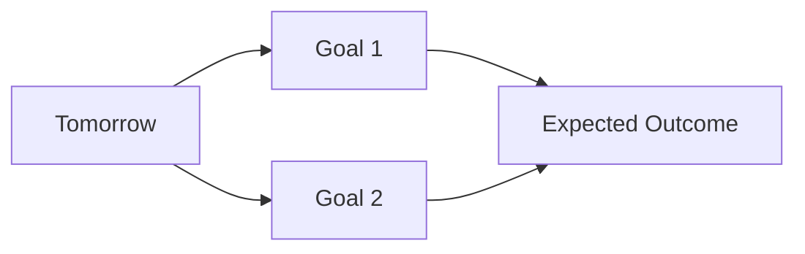
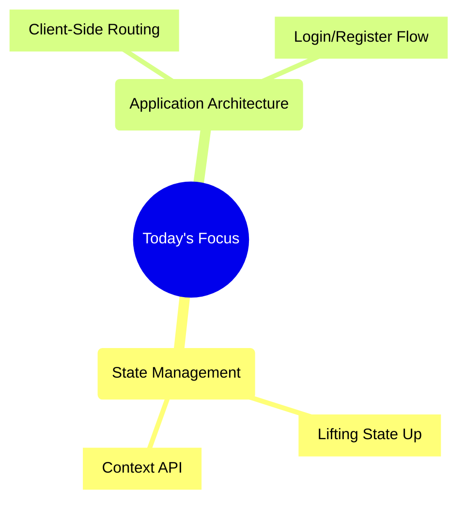

# 📝 Engineering Log | 05-09-2025

<div align="center">

```text
⭐️ Another day of building amazing things ⭐️
```

<p align="center">
  Day Progress:<br/>
  💖💖💖💖💖💖💖💖💖🖤 90%<br/>
  
</p>

</div>

## 🎯 Today's Goals

<details>
<summary>Daily Planning</summary>

### 📋 Priority Tasks

1. 🔴 High Priority
   - [x] Implement "Lifting State Up" architectural pattern.
   - [x] RImplement client-side routing with React Router.
2. 🟡 Medium Priority
   - [x] Create a global state solution with the React Context API.
   - [x] Build a functional Login/Register UI form.
3. 🟢 If Time Permits
   - [] Implement Protected Route

### 🎯 Goals & Expectations



</details>

---

## 💭 Final Thoughts

<details>
<summary>Day's Reflection</summary>

### 🌟 Achievements
> What made me proud today?
> I did all the creating states and handling states by myself and i am confident in it
### 📈 Growth
> How did I improve?
> I didnt need help from any source for most of the part and was able to write stuff on own
### 🎯 Areas for Improvement
> What could be better?
> I could focus more on the syntax stuff and learn fetching stuff
### 🌱 Personal Notes
> Additional thoughts or feelings about the day
 I feel good
</details>

---

<div align="center">

```text
End of Log | 05-09-2025
Keep building amazing things! 🚀
```

| Metric | Rating |
|:--|:--|
| Productivity | ⭐⭐⭐⭐⭐ |
| Learning | ⭐⭐⭐⭐⭐ |
| Enjoyment | ⭐⭐⭐⭐⭐ |

</div>

#engineering #daily-log #productivity

---

<details open>
<summary>🎯 Today's Mission</summary>

### Objectives



</details>

---

<details open>
<summary>⚡ Quick Stats</summary>

| Metric | Value |
|:--|:--|
| 🎯 Focus Areas | `development` `learning` `review` |
| ⏰ Time Logged | 1.0 hrs |
| 🔥 Energy Level | ▰▰▰▰▰▰▰▰▱▱ 80% |
| 🎭 Mood | ▰▰▰▰▰▰▰▰▱▱ 80% |

</details>

---

## 📝 Development Log

#### List the specific tasks, features, or problems you solved today

- [x] **Refactored Components:** Moved state and data-fetching logic from `JournalFeed` to `App.jsx`
- [x] **Implemented Prop Drilling:** Passed state (`entries`) and callback functions (`handleEntryAdded`) from parent to child components.
- [x] **Installed & Configured React Router:** Set up a multi-page structure with routes for `/` and `/auth`.
- [x] **Created `AuthContext`:** Built a global provider to manage the JWT and user session, persisting the token to `localStorage`.
- [x] **Built `AuthPage` UI:** Implemented a complete, functional form for both Login and Registration that connects to the `AuthContext`.


## 💡 Learning & Insights

<details open>
<summary>Knowledge Gained</summary>

### 🔬 Technical Discoveries

| Technology | Learning | Confidence |
|:--|:--|:--|
| React State | "Lifting State Up" is the core pattern for sharing data between sibling components; the parent must own the state. | 🔹🔹🔹🔹🔹🔹🔹🔹🔸🔸 80% |
| Context API| The standard for avoiding "prop drilling" with global data like authentication tokens. | 💛💛💛💛💛💛💛💚💚💚 70% |
| React Router | The useNavigate hook is the primary tool for programmatic redirection after events like a successful login. | 🔹🔹🔹🔹🔹🔹🔹🔹🔹🔸 90% |

### 🌟 Best Practices

> 💡 **Key Insight**: The parent component should be the "source of truth." Data flows down via props; events flow up via callback functions.
>
> **Why it matters**: This unidirectional data flow makes React applications predictable, easier to debug, and simpler to reason about as they grow in complexity.

### 📚 Resources & References

<details>
<summary>Expand Resources</summary>

- [📄 Resource 1](#) - Brief description
- [📚 Resource 2](#) - Brief description
- [🔗 Resource 3](#) - Brief description

</details>

</details>

## 🚧 Challenges & Solutions

<details>
<summary>Problems & Resolutions</summary>

### 🎯 Technical Challenges

```mermaid
flowchart LR
    A[Challenge: Frontend API calls failing] --> B{Investigation};
    B --> C[Check Network Tab];
    C --> D[Root Cause: Fetching from wrong port (`:5173`)];
    D --> E[Solution: Namespace all API routes with `/api`];
    E --> F[Outcome: Vite proxy correctly forwards requests];
```

### 💭 Lessons Learned

> 📝 **Key Takeaway**: When frontend and backend are on different ports, proxy configuration is critical. API requests must match the proxy path exactly.
>
> **Future Prevention**: Establish a clear API namespacing convention (`/api/v1/...`) at the start of any new project.

</details>

## 🔍 Code Snippets & Solutions

*Important code, commands, or solutions you discovered*

```language
// Your code snippet here
```

## 📚 Resources & References

*Links, articles, or tools that helped you today*

- [Resource Title](URL) - Brief description
- [Resource Title](URL) - Brief description

## 🎯 Tomorrow's Plan

*What will you focus on tomorrow?*

- [ ] Implement the `ProtectedRoute` component to prevent unauthenticated access.
- [ ] Refactor all components to consume the global `AuthContext` instead of using hardcoded tokens.
- [ ] Complete the full CRUD functionality by connecting the "Delete" and "Create" UI actions to the backend API via the global context.

## 💭 Reflection

*How do you feel about today's progress? What could you do better?*

> *Lets skip this and add this once project is finally done*

---

**Time Spent**: 1 hours  
**Energy Level**: ⭐⭐⭐⭐⭐ (1-5)  
**Satisfaction**: ⭐⭐⭐⭐⭐ (1-5)
