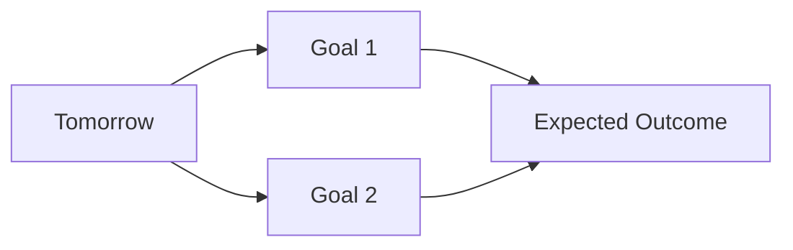
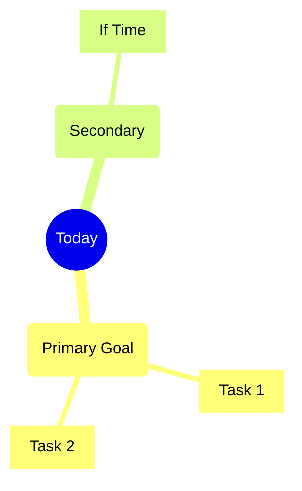
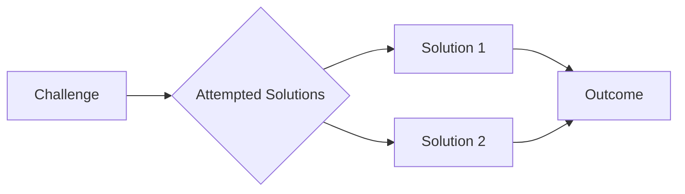

# 📝 Engineering Log | DD-MM-YYYY

<div align="center">

```text
⭐️ Another day of building amazing things ⭐️
```

<p align="center">
  Day Progress:<br/>
  <svg xmlns="http://www.w3.org/2000/svg" width="500" height="40">
    <linearGradient id="a" x2="0" y2="100%">
      <stop offset="0" stop-color="#bbb" stop-opacity=".2"/>
      <stop offset="1" stop-opacity=".1"/>
    </linearGradient>
    <rect rx="4" x="0" width="500" height="40" fill="#555"/>
    <rect rx="4" x="0" width="300" height="40" fill="#44CC11"/>
    <rect rx="4" width="500" height="40" fill="url(#a)"/>
    <g fill="#fff" text-anchor="middle" font-family="DejaVu Sans,Verdana,Geneva,sans-serif" font-size="22">
      <text x="250" y="28">60%</text>
    </g>
  </svg>
</p>

</div>

## 🎯 Today's Goals

<details>
<summary>Daily Planning</summary>

### 📋 Priority Tasks

1. 🔴 High Priority
   - [ ] Task 1
   - [ ] Task 2
2. 🟡 Medium Priority
   - [ ] Task 1
3. 🟢 If Time Permits
   - [ ] Task 1

### 🎯 Goals & Expectations



</details>

---

## 💭 Final Thoughts

<details>
<summary>Day's Reflection</summary>

### 🌟 Achievements
> What made me proud today?

### 📈 Growth
> How did I improve?

### 🎯 Areas for Improvement
> What could be better?

### 🌱 Personal Notes
> Additional thoughts or feelings about the day

</details>

---

<div align="center">

```text
End of Log | DD-MM-YYYY
Keep building amazing things! 🚀
```

| Metric | Rating |
|:--|:--|
| Productivity | ⭐⭐⭐⭐⭐ |
| Learning | ⭐⭐⭐⭐⭐ |
| Enjoyment | ⭐⭐⭐⭐⭐ |

</div>

#engineering #daily-log #productivity

---

<details open>
<summary>🎯 Today's Mission</summary>

### Objectives



</details>

---

<details open>
<summary>⚡ Quick Stats</summary>

| Metric | Value |
|:--|:--|
| 🎯 Focus Areas | `development` `learning` `review` |
| ⏰ Time Logged | 0.0 hrs |
| 🔥 Energy Level | <svg xmlns="http://www.w3.org/2000/svg" width="300" height="30"><linearGradient id="b" x2="0" y2="100%"><stop offset="0" stop-color="#bbb" stop-opacity=".2"/><stop offset="1" stop-opacity=".1"/></linearGradient><rect rx="4" x="0" width="300" height="30" fill="#555"/><rect rx="4" x="0" width="240" height="30" fill="#ff9900"/><rect rx="4" width="300" height="30" fill="url(#b)"/><g fill="#fff" text-anchor="middle" font-family="DejaVu Sans,Verdana,Geneva,sans-serif" font-size="18"><text x="150" y="21">80%</text></g></svg> |
| 🎭 Mood | <svg xmlns="http://www.w3.org/2000/svg" width="300" height="30"><linearGradient id="c" x2="0" y2="100%"><stop offset="0" stop-color="#bbb" stop-opacity=".2"/><stop offset="1" stop-opacity=".1"/></linearGradient><rect rx="4" x="0" width="300" height="30" fill="#555"/><rect rx="4" x="0" width="210" height="30" fill="#44CC11"/><rect rx="4" width="300" height="30" fill="url(#c)"/><g fill="#fff" text-anchor="middle" font-family="DejaVu Sans,Verdana,Geneva,sans-serif" font-size="18"><text x="150" y="21">70%</text></g></svg> |

</details>

---

## 📝 Development Log

#### List the specific tasks, features, or problems you solved today

- [ ] Task 1
- [ ] Task 2
- [ ] Task 3

## 💡 Learning & Insights

<details open>
<summary>Knowledge Gained</summary>

### 🔬 Technical Discoveries

| Technology | Learning | Confidence |
|:--|:--|:--|
| Tech 1 | Key insight learned | <svg xmlns="http://www.w3.org/2000/svg" width="200" height="25"><linearGradient id="d" x2="0" y2="100%"><stop offset="0" stop-color="#bbb" stop-opacity=".2"/><stop offset="1" stop-opacity=".1"/></linearGradient><rect rx="4" x="0" width="200" height="25" fill="#555"/><rect rx="4" x="0" width="170" height="25" fill="#007ec6"/><rect rx="4" width="200" height="25" fill="url(#d)"/><g fill="#fff" text-anchor="middle" font-family="DejaVu Sans,Verdana,Geneva,sans-serif" font-size="16"><text x="100" y="18">85%</text></g></svg> |
| Tech 2 | Key insight learned | <svg xmlns="http://www.w3.org/2000/svg" width="200" height="25"><linearGradient id="e" x2="0" y2="100%"><stop offset="0" stop-color="#bbb" stop-opacity=".2"/><stop offset="1" stop-opacity=".1"/></linearGradient><rect rx="4" x="0" width="200" height="25" fill="#555"/><rect rx="4" x="0" width="140" height="25" fill="#007ec6"/><rect rx="4" width="200" height="25" fill="url(#e)"/><g fill="#fff" text-anchor="middle" font-family="DejaVu Sans,Verdana,Geneva,sans-serif" font-size="16"><text x="100" y="18">70%</text></g></svg> |

### 🌟 Best Practices

> 💡 **Key Insight**: Important realization or learning
>
> **Why it matters**: Brief explanation of the impact

### 📚 Resources & References

<details>
<summary>Expand Resources</summary>

- [📄 Resource 1](#) - Brief description
- [📚 Resource 2](#) - Brief description
- [🔗 Resource 3](#) - Brief description

</details>

</details>

## 🚧 Challenges & Solutions

<details>
<summary>Problems & Resolutions</summary>

### 🎯 Technical Challenges



### 💭 Lessons Learned

> 📝 **Key Takeaway**: Main lesson from today's challenges
>
> **Future Prevention**: How to avoid similar issues

</details>

## 🔍 Code Snippets & Solutions

*Important code, commands, or solutions you discovered*

```language
// Your code snippet here
```

## 📚 Resources & References

*Links, articles, or tools that helped you today*

- [Resource Title](URL) - Brief description
- [Resource Title](URL) - Brief description

## 🎯 Tomorrow's Plan

*What will you focus on tomorrow?*

- [ ] Priority task 1
- [ ] Priority task 2
- [ ] Priority task 3

## 💭 Reflection

*How do you feel about today's progress? What could you do better?*

> *Your thoughts here...*

---

**Time Spent**: X hours  
**Energy Level**: ⭐⭐⭐⭐⭐ (1-5)  
**Satisfaction**: ⭐⭐⭐⭐⭐ (1-5)
