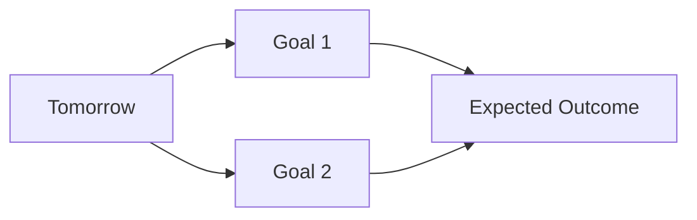
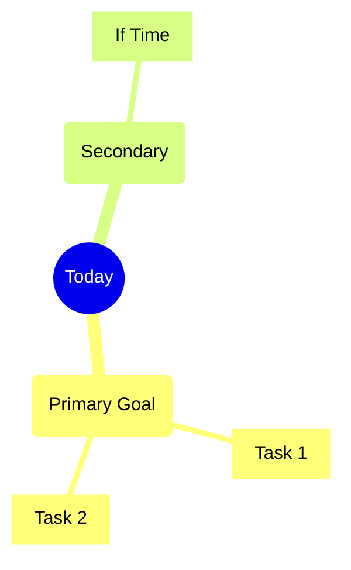
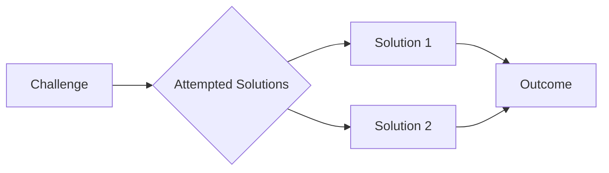

# 📝 Engineering Log | DD-MM-YYYY

<div align="center">

```text
⭐️ Another day of building amazing things ⭐️
```

<p align="center">
  Day Progress:<br/>

  
</p>

</div>

## 🎯 Today's Goals

<details>
<summary>Daily Planning</summary>

### 📋 Priority Tasks

1. 🔴 High Priority
   - [ ] Task 1
   - [ ] Task 2
2. 🟡 Medium Priority
   - [ ] Task 1
3. 🟢 If Time Permits
   - [ ] Task 1

### 🎯 Goals & Expectations



</details>

---

## 💭 Final Thoughts

<details>
<summary>Day's Reflection</summary>

### 🌟 Achievements
> What made me proud today?

### 📈 Growth
> How did I improve?

### 🎯 Areas for Improvement
> What could be better?

### 🌱 Personal Notes
> Additional thoughts or feelings about the day

</details>

---

<div align="center">

```text
End of Log | DD-MM-YYYY
Keep building amazing things! 🚀
```

| Metric | Rating |
|:--|:--|
| Productivity | ⭐⭐⭐⭐⭐ |
| Learning | ⭐⭐⭐⭐⭐ |
| Enjoyment | ⭐⭐⭐⭐⭐ |

</div>

#engineering #daily-log #productivity

---

<details open>
<summary>🎯 Today's Mission</summary>

### Objectives



</details>

---

<details open>
<summary>⚡ Quick Stats</summary>

| Metric | Value |
|:--|:--|
| 🎯 Focus Areas | `development` `learning` `review` |
| ⏰ Time Logged | 0.0 hrs |
| 🔥 Energy Level | <svg width="120" height="120" viewBox="-25 -25 250 250" version="1.1" xmlns="http://www.w3.org/2000/svg" style="transform:rotate(-90deg)"><circle r="90" cx="100" cy="100" fill="transparent" stroke="#e0e0e0" stroke-width="16px"></circle><circle r="90" cx="100" cy="100" stroke="#ff9900" stroke-width="16px" stroke-linecap="round" stroke-dashoffset="113.096" fill="transparent" stroke-dasharray="565.48"></circle><text x="71" y="115" fill="#ff9900" font-size="52px" font-weight="bold" style="transform:rotate(90deg) translate(0, -196px)">80%</text></svg> |
| 🎭 Mood | <svg width="120" height="120" viewBox="-25 -25 250 250" version="1.1" xmlns="http://www.w3.org/2000/svg" style="transform:rotate(-90deg)"><circle r="90" cx="100" cy="100" fill="transparent" stroke="#e0e0e0" stroke-width="16px"></circle><circle r="90" cx="100" cy="100" stroke="#44CC11" stroke-width="16px" stroke-linecap="round" stroke-dashoffset="169.644" fill="transparent" stroke-dasharray="565.48"></circle><text x="71" y="115" fill="#44CC11" font-size="52px" font-weight="bold" style="transform:rotate(90deg) translate(0, -196px)">70%</text></svg> |

</details>

---

## 📝 Development Log

#### List the specific tasks, features, or problems you solved today

- [ ] Task 1
- [ ] Task 2
- [ ] Task 3

## 💡 Learning & Insights

<details open>
<summary>Knowledge Gained</summary>

### 🔬 Technical Discoveries

| Technology | Learning | Confidence |
|:--|:--|:--|
| Tech 1 | Key insight learned | <svg width="100" height="100" viewBox="-25 -25 250 250" version="1.1" xmlns="http://www.w3.org/2000/svg" style="transform:rotate(-90deg)"><circle r="90" cx="100" cy="100" fill="transparent" stroke="#e0e0e0" stroke-width="16px"></circle><circle r="90" cx="100" cy="100" stroke="#007ec6" stroke-width="16px" stroke-linecap="round" stroke-dashoffset="84.822" fill="transparent" stroke-dasharray="565.48"></circle><text x="71" y="115" fill="#007ec6" font-size="52px" font-weight="bold" style="transform:rotate(90deg) translate(0, -196px)">85%</text></svg> |
| Tech 2 | Key insight learned | <svg width="100" height="100" viewBox="-25 -25 250 250" version="1.1" xmlns="http://www.w3.org/2000/svg" style="transform:rotate(-90deg)"><circle r="90" cx="100" cy="100" fill="transparent" stroke="#e0e0e0" stroke-width="16px"></circle><circle r="90" cx="100" cy="100" stroke="#007ec6" stroke-width="16px" stroke-linecap="round" stroke-dashoffset="169.644" fill="transparent" stroke-dasharray="565.48"></circle><text x="71" y="115" fill="#007ec6" font-size="52px" font-weight="bold" style="transform:rotate(90deg) translate(0, -196px)">70%</text></svg> |

### 🌟 Best Practices

> 💡 **Key Insight**: Important realization or learning
>
> **Why it matters**: Brief explanation of the impact

### 📚 Resources & References

<details>
<summary>Expand Resources</summary>

- [📄 Resource 1](#) - Brief description
- [📚 Resource 2](#) - Brief description
- [🔗 Resource 3](#) - Brief description

</details>

</details>

## 🚧 Challenges & Solutions

<details>
<summary>Problems & Resolutions</summary>

### 🎯 Technical Challenges



### 💭 Lessons Learned

> 📝 **Key Takeaway**: Main lesson from today's challenges
>
> **Future Prevention**: How to avoid similar issues

</details>

## 🔍 Code Snippets & Solutions

*Important code, commands, or solutions you discovered*

```language
// Your code snippet here
```

## 📚 Resources & References

*Links, articles, or tools that helped you today*

- [Resource Title](URL) - Brief description
- [Resource Title](URL) - Brief description

## 🎯 Tomorrow's Plan

*What will you focus on tomorrow?*

- [ ] Priority task 1
- [ ] Priority task 2
- [ ] Priority task 3

## 💭 Reflection

*How do you feel about today's progress? What could you do better?*

> *Your thoughts here...*

---

**Time Spent**: X hours  
**Energy Level**: ⭐⭐⭐⭐⭐ (1-5)  
**Satisfaction**: ⭐⭐⭐⭐⭐ (1-5)
